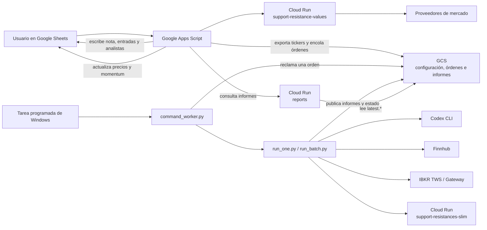
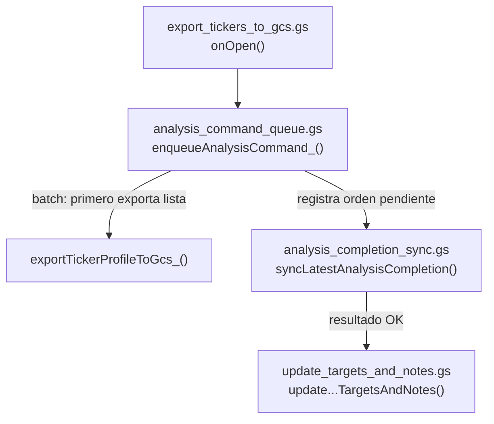
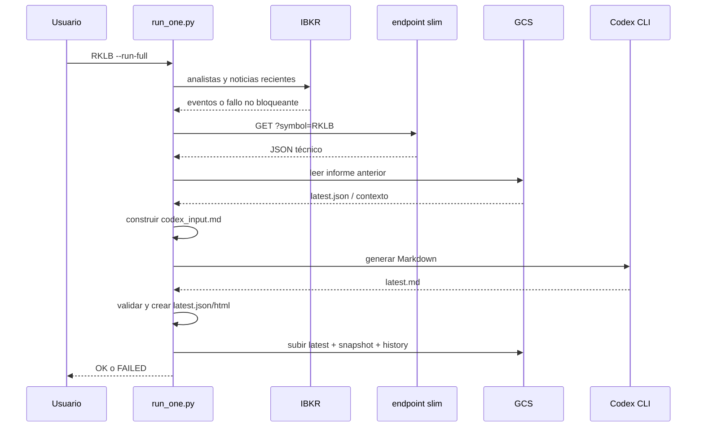
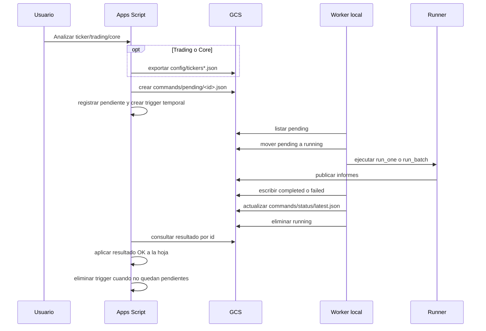

# Arquitectura del sistema

Este documento explica dónde está cada pieza del sistema, qué responsabilidad
tiene y cómo se relaciona con las demás. Es el punto de entrada recomendado
antes de modificar código, desplegar servicios o investigar un fallo.

Para ejecutar operaciones concretas, consulta también
[`operations.md`](operations.md). Para preparar otro ordenador, consulta
[`new_computer_setup.md`](new_computer_setup.md).

## 1. Resumen ejecutivo

El sistema no es una única aplicación. Es un conjunto de componentes unidos por
Google Cloud Storage (GCS):

1. Google Sheets contiene las listas de acciones y presenta los resultados.
2. Google Apps Script exporta listas, crea órdenes y actualiza la hoja.
3. GCS actúa como almacén de informes, configuración y cola de mensajes.
4. Un worker en el ordenador local recoge las órdenes.
5. El runner Python local obtiene datos técnicos, noticias y analistas, llama a
   Codex, valida el informe y lo publica.
6. Cloud Run expone los informes de GCS a Apps Script.
7. Otro servicio de Cloud Run calcula precios, niveles técnicos y métricas
   utilizadas por las hojas.

El ordenador local es el motor del análisis de IA. Apps Script no ejecuta Codex,
no accede a IBKR y no lee los archivos locales.



## 2. Qué código es fuente de verdad

Antes de editar, distingue estas tres categorías.

### 2.1 Código activo en este repositorio

Estas carpetas contienen las versiones que deben mantenerse:

| Carpeta | Responsabilidad |
|---|---|
| `src/` | Runner local, worker, validación, informes, IBKR y GCS |
| `prompts/` | Instrucciones de análisis usadas por Codex |
| `apps_script/` | Copia versionada del proyecto de Google Apps Script |
| `gcp_functions/reports_reader/` | Fuente del servicio Cloud Run `reports` |
| `gcp_functions/support_resistance_values/` | Fuente versionada del servicio de métricas para Sheets |
| `scripts/` | Instalación, lanzadores, tareas y despliegues repetibles |
| `tests/` | Pruebas automatizadas |
| `docs/` | Operación, arquitectura y decisiones |

### 2.2 Dependencias desplegadas fuera del repositorio activo

El runner consume este servicio, pero su fuente activa no está mantenida en las
carpetas anteriores:

| Servicio | Consumidor | Situación |
|---|---|---|
| `support-resistances-slim` | `src/local_runner/run_one.py` | Dependencia remota activa. Solo existe una instantánea histórica bajo `incoming_from_gcp/support-resistances-slim/`. |

No se debe asumir que la instantánea histórica coincide con el servicio
desplegado. Antes de modificar o redesplegar ese servicio hay que localizar su
fuente de verdad actual y comparar versiones.

### 2.3 Referencia histórica

`incoming_from_gcp/` es una captura antigua procedente de GCP. Sirve para
consultar cómo funcionaba el sistema anterior, pero:

- no es el motor diario;
- no debe recibir cambios operativos;
- no es la fuente de verdad de los prompts;
- no debe desplegarse sin una comparación explícita con el sistema activo.

## 3. Mapa del repositorio

```text
stock-analysis-local/
├── apps_script/          Código vinculado a la Google Sheet
├── data/                 Estado local y entradas obtenidas de servicios
├── docs/                 Documentación técnica y operativa
├── examples/             Ejemplos de órdenes JSON
├── gcp_functions/        Código de servicios HTTP desplegados en Cloud Run
├── incoming_from_gcp/    Instantánea histórica; no es código operativo
├── logs/                 Trazas locales de runners, batches y worker
├── output/               Últimos artefactos generados por ticker
├── prompts/              Prompt activo de Codex y plantilla de referencia
├── scripts/              Entradas operativas para Windows y despliegues
├── src/                  Aplicación Python local
├── tests/                Pruebas automatizadas
├── .env.example          Variables locales admitidas, sin secretos
├── .env.local            Secretos locales; ignorado por Git
├── requirements.txt      Dependencias mínimas de operación local
└── requirements-dev.txt  Dependencias de pruebas y servicios
```

Las carpetas `data/`, `logs/` y `output/` contienen estado de ejecución. No son
la fuente del código, aunque parte de `data/` actúa como caché persistente entre
análisis.

## 4. Componentes principales

### 4.1 Runner local Python

El paquete `src/local_runner/` es el centro de control.

#### Orquestadores

| Archivo | Papel | Invocado por |
|---|---|---|
| `run_one.py` | Ejecuta las fases de un ticker | Usuario, lanzador, batch o worker |
| `run_batch.py` | Ejecuta varios tickers con paralelismo y reintentos | Usuario, lanzador o worker |
| `command_worker.py` | Consume una orden de la cola GCS | Tarea programada de Windows |

`run_one.py` es el orquestador principal. Su flujo completo es:

```text
preflight no bloqueante
  ├── actualizar estado de analistas desde IBKR
  └── actualizar noticias recientes desde IBKR
prepare
  ├── descargar JSON técnico del endpoint slim
  ├── leer análisis anterior desde GCS
  ├── leer estado local de analistas y noticias
  └── construir output/<TICKER>/codex_input.md
generate
  └── Codex CLI escribe output/<TICKER>/latest.md
validate
  ├── validar el contrato Markdown
  ├── construir latest.json estructurado
  └── renderizar latest.html
upload real
  ├── subir latest.md, latest.html y latest.json
  ├── crear snapshots fechados
  └── actualizar history.json y podar snapshots antiguos
```

La actualización de IBKR es no bloqueante: si TWS/Gateway no está disponible,
el análisis continúa con el último estado local válido.

`run_batch.py` obtiene la lista de tickers, ejecuta los preflight de forma
agregada y después lanza un `run_one --run-full --skip-preflight-updates` por
ticker. Registra cada resultado, continúa cuando un ticker falla y puede
reanudar o reintentar fallos.

`command_worker.py` solo acepta estas acciones:

| Acción GCS | Comando local resultante |
|---|---|
| `analyze_ticker` | `run_one <TICKER> --run-full` |
| `analyze_trading` | `run_batch --from-gcs --upload-real` |
| `analyze_core` | `run_batch --config-gcs .../tickers_core.json --upload-real` |

No admite comandos de shell ni rutas arbitrarias.

#### Generación y validación

| Archivo | Responsabilidad |
|---|---|
| `codex_generator.py` | Localiza Codex CLI, ejecuta la generación no interactiva y recoge uso |
| `src/common/analysis_validator.py` | Verifica que el Markdown cumpla el contrato exigido |
| `report_schema.py` | Convierte el Markdown validado en campos estructurados y alertas |
| `html_report.py` | Convierte Markdown validado en un HTML autocontenido |
| `previous_analysis.py` | Lee el último análisis publicado y crea contexto de continuidad |
| `report_archive.py` | Mantiene `history.json` y limita snapshots en GCS |
| `gcs_uploader.py` | Construye y ejecuta las subidas `gcloud storage cp` |

Una validación fallida sigue escribiendo `latest.json` con
`analysis_status: "failed"`. Así los consumidores ven el fallo y no interpretan
un informe antiguo como recién generado. En ese caso no se sobrescriben
`latest.md` ni `latest.html` remotos; se publica además un snapshot
`*.error.json`.

#### Analistas y noticias

| Archivo o grupo | Responsabilidad |
|---|---|
| `ibkr_analyst_probe.py` | Descarga titulares de acciones de analistas desde IBKR |
| `analyst_actions.py` | Parsea titulares en eventos estructurados |
| `analyst_ratings.py` | Mantiene el estado vigente por firma |
| `ibkr_analyst_update.py` | Coordina la actualización de un ticker |
| `update_analyst_ratings_batch.py` | Actualiza una lista de tickers |
| `analyst_quality.py` | Evalúa calidad y frescura del consenso |
| `analyst_recent_actions.py` | Selecciona acciones posteriores al informe anterior para el prompt |
| `analyst_summary.py` | Produce el resumen compacto destinado a JSON y Sheets |
| `backfill_analyst_summaries.py` | Añade resúmenes a informes existentes sin regenerarlos |
| `ibkr_news_update.py` | Descarga titulares generales recientes de IBKR |
| `update_ibkr_news_batch.py` | Actualiza noticias de una lista |
| `ibkr_news_articles.py` | Recupera cuerpos cuando hacen falta |
| `ibkr_news_events.py` | Agrupa titulares relacionados |
| `ibkr_recent_news.py` | Prepara el bloque compacto que recibe Codex |

Los dos productos de analistas tienen propósitos distintos:

- `analyst_ratings_summary` es un agregado para `latest.json` y Google Sheets;
- las acciones recientes desde el informe anterior sí pueden entrar en el
  prompt como catalizadores.

El consenso histórico agregado no se usa automáticamente para alterar la nota
diaria.

#### Otros auxiliares

| Archivo | Responsabilidad |
|---|---|
| `finnhub_earnings.py` | Calendario de resultados mediante Finnhub |
| `ibkr_earnings_probe.py` | Eventos corporativos mediante IBKR WSH |
| `local_env.py` | Lectura segura de `.env.local` |
| `codex_rate_limits.py` | Consulta local de ventanas de cuota de Codex |
| `benchmark_models.py` | Comparaciones aisladas de modelo y esfuerzo |
| `audit_analyst_firm_aliases.py` | Detecta posibles duplicados de firmas |
| `push_apps_script_file.py` | Publica de forma segura un único archivo Apps Script |

### 4.2 Prompts

| Archivo | Estado |
|---|---|
| `prompts/stock_analysis_system_prompt.md` | Fuente de verdad activa; `run_one.py` lo carga directamente |
| `prompts/stock_analysis_user_prompt_template.md` | Plantilla y referencia documental; el runner actual no la carga como archivo |

`run_one.py` construye dinámicamente `codex_input.md` combinando:

- prompt de sistema activo;
- JSON técnico del endpoint slim;
- contexto compacto del informe anterior;
- calidad y acciones recientes de analistas;
- noticias recientes de IBKR;
- fecha, ticker y rutas de salida.

Por tanto, un cambio en el formato de salida suele requerir revisar juntos:

```text
prompts/stock_analysis_system_prompt.md
src/common/analysis_validator.py
src/local_runner/report_schema.py
apps_script/update_targets_and_notes.gs
tests/
```

### 4.3 Google Apps Script

`apps_script/` es la copia local versionada del proyecto vinculado mediante
`.clasp.json`. Todos los archivos `.gs` viven en el mismo espacio global cuando
se publican; pueden llamar funciones definidas en otros archivos.

#### Análisis y sincronización

| Archivo | Responsabilidad | Se relaciona con |
|---|---|---|
| `export_tickers_to_gcs.gs` | Crea el menú, lee tickers y exporta las listas a GCS | `run_batch.py` |
| `analysis_command_queue.gs` | Crea órdenes `pending` desde la hoja | `command_worker.py` |
| `analysis_completion_sync.gs` | Vigila resultados terminados y actualiza la hoja | Cola GCS y `update_targets_and_notes.gs` |
| `update_targets_and_notes.gs` | Lee informes y escribe entradas, nota y analistas | Servicio `reports` |

Dependencias entre estos archivos:



`analysis_completion_sync.gs` crea un trigger temporal de un minuto cuando hay
órdenes pendientes y lo elimina cuando ya no queda ninguna. No necesita un
trigger permanente.

#### Precios, métricas y régimen de mercado

| Archivo | Responsabilidad |
|---|---|
| `value_refresh_1m_trading.gs` | Actualiza precios y métricas del bloque Trading |
| `value_refresh_1m_core.gs` | Actualiza precios y métricas del bloque Core |
| `nasdaq_risk_regime.gs` | Calcula y cachea régimen Nasdaq y sentimiento |
| `value_refresh_1m_cache_fix_snippet.gs` | Herramienta puntual para limpiar propiedades antiguas |
| `copia_value_refresh_1m_disabled.gs` | Copia deshabilitada; no debe tratarse como flujo activo |

Estos scripts llaman al servicio `support-resistance-values` y, para algunas
cotizaciones, a Yahoo Finance. Este flujo de precios es independiente del
runner de análisis, aunque ambos terminan presentándose en la misma hoja.

### 4.4 Servicios en Cloud Run

#### `reports`

| Dato | Valor |
|---|---|
| Fuente | `gcp_functions/reports_reader/` |
| Despliegue | `scripts/deploy_reports_reader.cmd` |
| Verificación | `scripts/check_reports_reader.cmd <TICKER>` |
| Servicio | `reports` |
| Región | `europe-southwest1` |
| Proyecto | `recipe-generator-429817` |
| Entrada | `symbol`, `format`, `debug` |
| Almacén leído | `gs://stock-analysis-reports-naxo85/<TICKER>/latest.*` |

Formatos:

```text
?symbol=RKLB              JSON compacto para aplicaciones
?symbol=RKLB&format=md    Markdown completo
?symbol=RKLB&format=html  Informe HTML
?symbol=RKLB&debug=true   JSON completo almacenado
```

Google Sheets usa el JSON compacto. `latest.json` en GCS sigue siendo el contrato
completo y la fuente de verdad.

#### `support-resistance-values`

| Dato | Valor |
|---|---|
| Fuente versionada | `gcp_functions/support_resistance_values/` |
| Consumidores | `value_refresh_1m_*.gs` y `nasdaq_risk_regime.gs` |
| Función | Cotización, soportes, resistencias, opciones, volumen, RSI y drawdown |
| Proveedores | Twelve Data, Tradier, Yahoo/CNN y otros según la métrica |
| Despliegue | No hay actualmente un script de despliegue repetible en `scripts/` |

Antes de redesplegar este servicio hay que reconstruir y documentar su
configuración de entorno, cuenta de servicio y secretos. La ausencia del script
de despliegue es una deuda operativa conocida.

#### `support-resistances-slim`

| Dato | Valor |
|---|---|
| Consumidor | `src/local_runner/run_one.py` |
| Función | JSON técnico compacto usado para preparar el análisis |
| Fuente activa | No está identificada en el código activo del repositorio |
| Referencia | `incoming_from_gcp/support-resistances-slim/` |

Es una dependencia crítica del runner. Una caída de este endpoint impide la fase
`prepare`.

### 4.5 Scripts de Windows

Los archivos de `scripts/` son adaptadores operativos. La lógica de negocio debe
permanecer en Python o Apps Script.

#### Instalación y diagnóstico

| Script | Uso |
|---|---|
| `setup_new_pc.ps1` | Crea `.venv`, instala dependencias y crea `.env.local` |
| `check_new_pc.ps1` | Comprueba Python, Codex, GCloud, claves, endpoint e IBKR |
| `install_desktop_shortcuts.ps1/.vbs` | Crea accesos directos |
| `remove_desktop_shortcuts.ps1/.vbs` | Elimina accesos directos |

#### Lanzadores

| Script | Destino |
|---|---|
| `analyze_ticker.ps1` | `run_one <TICKER> --run-full` |
| `analyze_trading.ps1` | Batch desde `config/tickers.json` |
| `analyze_core.ps1` | Batch desde `config/tickers_core.json` |
| `stock_analysis_launcher_common.ps1` | Funciones compartidas de los lanzadores |
| `run_rklb_local_flow.ps1` | Flujo específico antiguo/diagnóstico de RKLB |

#### Worker

| Script | Uso |
|---|---|
| `process_command_queue_once.ps1` | Ejecuta una consulta manual de la cola |
| `run_command_worker_hidden.vbs` | Ejecuta el worker sin ventana |
| `install_command_worker_task.ps1/.vbs` | Instala la tarea cada minuto |
| `remove_command_worker_task.ps1/.vbs` | Elimina la tarea |

#### GCP, Apps Script y mantenimiento

| Script | Uso |
|---|---|
| `deploy_reports_reader.cmd` | Despliega el servicio `reports` |
| `check_reports_reader.cmd` | Verifica su respuesta |
| `push_apps_script_file.cmd` | Publica un archivo Apps Script con controles |
| `apps_script_status.cmd` | Comprueba login y estado de `clasp` |
| `update_analyst_ratings.cmd` | Wrapper de actualización de analistas |
| `update_ibkr_news.cmd` | Wrapper de actualización de noticias |
| `backfill_analyst_summaries.cmd` | Wrapper de backfill |
| `audit_analyst_firm_aliases.cmd` | Wrapper de auditoría de firmas |

## 5. Flujos completos

### 5.1 Análisis directo de un ticker

Entrada:

```powershell
.\.venv\Scripts\python.exe -m src.local_runner.run_one RKLB --run-full
```

Secuencia:



Archivos locales principales:

```text
data/slim/RKLB/<timestamp>.json
data/analyst_ratings/RKLB/current.json
data/ibkr_news_recent/RKLB/latest.json
output/RKLB/codex_input.md
output/RKLB/latest.md
output/RKLB/latest.json
output/RKLB/latest.html
output/RKLB/history.json
logs/RKLB/*.json
```

### 5.2 Batch Trading o Core

Trading:

```text
GCS config/tickers.json
  -> run_batch.py
  -> actualización agregada de analistas
  -> actualización agregada de noticias
  -> N procesos run_one con preflight omitido
  -> logs/batch/.../summary.json
```

Core es idéntico, pero usa `config/tickers_core.json`.

La configuración estable es `--max-parallel 2`. Los lanzadores y las órdenes
de Sheets usan normalmente `6` para reducir el tiempo total. El límite del
runner es `8`.

### 5.3 Orden iniciada desde Google Sheets



La reclamación se realiza moviendo el objeto de `pending` a `running`. Además,
el worker usa `logs/command_worker.lock` para impedir dos ejecuciones locales.

### 5.4 Retorno del informe a la hoja

```text
output/<TICKER>/latest.json
  -> GCS <TICKER>/latest.json
  -> Cloud Run reports
  -> Apps Script update_targets_and_notes.gs
  -> columnas de la Google Sheet
```

El lector devuelve `analysis_markdown` y `analyst_ratings_summary`. Apps Script
extrae del Markdown la nota y los rangos; del objeto estructurado toma el
resumen de analistas.

### 5.5 Actualización de precios y momentum

Este flujo no pasa por Codex:

```text
Google Apps Script value_refresh_1m_*.gs
  -> Cloud Run support-resistance-values
  -> proveedores de mercado
  -> métricas y niveles
  -> Google Sheet
```

`nasdaq_risk_regime.gs` mantiene además señales de mercado y cachés en
`ScriptProperties`.

## 6. Contratos de datos

### 6.1 Estado local

| Ruta | Productor | Consumidor | Propósito |
|---|---|---|---|
| `data/slim/<TICKER>/*.json` | `run_one --prepare` | Validación y auditoría | Capturas técnicas |
| `data/analyst_ratings/<TICKER>/current.json` | Actualizador IBKR | Prompt, JSON y Sheets | Estado vigente por firma |
| `data/ibkr_news_recent/<TICKER>/latest.json` | Actualizador IBKR | Prompt | Titulares recientes |
| `data/ibkr_news_events/<TICKER>/latest.json` | Agregador | Diagnóstico y evolución | Eventos agrupados |
| `output/<TICKER>/codex_input.md` | Prepare | Codex | Entrada final generada |
| `output/<TICKER>/latest.md` | Codex | Validador y uploader | Informe humano |
| `output/<TICKER>/latest.json` | Validador | GCS y aplicaciones | Contrato estructurado |
| `output/<TICKER>/latest.html` | Renderizador | GCS y navegador | Informe visual |
| `logs/<TICKER>/*.json` | Runner | Operación | Trazas por fase |
| `logs/batch/.../summary.json` | Batch | Operación/reanudación | Resultado del lote |
| `logs/command_worker/...` | Worker | Operación | Resultado de órdenes |

### 6.2 Espacio GCS

Bucket central:

```text
gs://stock-analysis-reports-naxo85/
```

Mapa:

```text
config/
├── tickers.json                  Lista Trading exportada por Sheets
└── tickers_core.json             Lista Core exportada por Sheets

commands/
├── pending/<id>.json             Orden aún no reclamada
├── running/<id>.json             Orden reclamada
├── completed/<id>.json           Resultado correcto
├── failed/<id>.json              Resultado fallido
└── status/latest.json            Último resultado publicado

<TICKER>/
├── latest.md                     Último informe correcto
├── latest.html                   Último HTML correcto
├── latest.json                   Último estado, correcto o fallido
├── history.json                  Historial compacto
└── YYYY-MM-DD/
    ├── HH-MM-SS.md               Snapshot correcto
    ├── HH-MM-SS.html             Snapshot correcto
    ├── HH-MM-SS.json             Snapshot correcto
    └── HH-MM-SS.error.json       Snapshot de fallo

_local_test/<TICKER>/
├── latest.md
├── latest.html
└── latest.json
```

La retención automática conserva cinco snapshots correctos y dos fallidos por
ticker. `history.json` conserva el resumen compacto más allá de esos archivos.

### 6.3 Columnas de Google Sheets

Ambos perfiles viven actualmente en `Bolsa_2026`.

| Campo | Trading | Core |
|---|---:|---:|
| Ticker | D | AG |
| Precio actual | F | AI |
| Entrada ambiciosa | Y | BB |
| Entrada normal | Z | BC |
| Nota | AA | BD |
| Analistas | AB | BE |
| Momentum | AC | BF |
| Fecha de actualización completa | AD5 | AD6 |

La configuración está duplicada deliberadamente en dos contextos:

- columnas de tickers para exportación: `export_tickers_to_gcs.gs`;
- columnas de resultados: `update_targets_and_notes.gs`.

Si cambia la estructura de la hoja hay que revisar ambos archivos, además de
los scripts `value_refresh_1m_trading.gs` y `value_refresh_1m_core.gs`.

## 7. Configuración, identidades y secretos

### 7.1 Configuración versionada

| Configuración | Ubicación |
|---|---|
| Modelo y esfuerzo por defecto | `run_one.py` y `run_batch.py` |
| Bucket y rutas GCS | Constantes en Python y Apps Script |
| Columnas de Sheets | Perfiles en los archivos `.gs` |
| Prompt activo | `prompts/stock_analysis_system_prompt.md` |
| Proyecto Apps Script | `apps_script/.clasp.json` |
| Scopes Apps Script | `apps_script/appsscript.json` |
| Despliegue de `reports` | `scripts/deploy_reports_reader.cmd` |

### 7.2 Secretos y autenticación

| Secreto o identidad | Dónde vive | Uso |
|---|---|---|
| `FINN_KEY` / `FINNHUB_API_KEY` | `.env.local` | Calendario de resultados |
| `GEMINI_API_KEY` / `GOOGLE_API_KEY` | `.env.local`, opcional | Agregación secundaria de noticias |
| Login Codex | Instalación local de Codex | Generación |
| Login GCloud | Credenciales locales del SDK | Leer/escribir GCS y desplegar |
| Login `clasp` | Configuración local de `clasp` | Sincronizar Apps Script |
| Login IBKR | TWS/Gateway local | Noticias, analistas y eventos |
| Tokens de mercado del servicio values | Entorno de Cloud Run | Métricas de mercado |

`.env.local` no debe subirse a Git. Tampoco deben copiarse tokens desde Cloud
Run al repositorio.

### 7.3 Permisos Apps Script

El manifest solicita:

- acceso a la hoja actual;
- llamadas HTTP externas;
- lectura y escritura de GCS;
- gestión de triggers.

Apps Script usa el token OAuth del usuario para acceder a GCS. La cuenta que
ejecuta la hoja debe tener permisos sobre el bucket.

## 8. Despliegues y sincronización

| Componente | Fuente local | Mecanismo | Estado documental |
|---|---|---|---|
| Runner local | `src/`, `prompts/` | Git + instalación en PC | Documentado |
| Apps Script | `apps_script/` | `push_apps_script_file.cmd` / `clasp` | Documentado con flujo seguro |
| Cloud Run `reports` | `gcp_functions/reports_reader/` | `deploy_reports_reader.cmd` | Repetible |
| Cloud Run `support-resistance-values` | `gcp_functions/support_resistance_values/` | Manual/no codificado | Pendiente de normalizar |
| Cloud Run `support-resistances-slim` | Fuente activa no localizada | Desconocido | No redesplegar desde la instantánea |
| Tarea programada | `scripts/install_command_worker_task.*` | Windows Task Scheduler | Repetible |
| Accesos directos | `scripts/install_desktop_shortcuts.*` | Windows | Repetible |

Apps Script requiere especial precaución porque el remoto puede contener una
versión distinta. El flujo seguro está implementado en
`src/local_runner/push_apps_script_file.py`: descarga dos copias, modifica solo
el archivo solicitado, compara cambios y publica únicamente cuando se pasa el
indicador explícito.

## 9. Observabilidad y fallos

### 9.1 Dónde mirar primero

| Síntoma | Primera comprobación |
|---|---|
| No se prepara ningún análisis | Endpoint slim y log `*.prepare.json` |
| Codex no genera | Salida de `codex_generator.py`, login y cuotas |
| El informe se genera pero falla | `*.validate.json` y `latest.failed.json` |
| No aparece en GCS | Fase `upload_real`, login GCloud y permisos |
| Una orden no arranca | `commands/pending/`, tarea programada y lock local |
| Una orden queda en running | `commands/running/` y logs del worker |
| La hoja no se actualiza | Resultado `completed`, trigger temporal y Apps Script logs |
| La hoja recibe HTTP 404 | `<TICKER>/latest.json` y servicio `reports` |
| Fallan precios/momentum | Servicio `support-resistance-values`, no el runner |
| No hay analistas/noticias nuevas | Puerto IBKR `7497` y estado local anterior |

### 9.2 Principios de fallo

- Analistas y noticias IBKR son enriquecimientos no bloqueantes.
- El endpoint slim, Codex, validación y publicación son fases críticas.
- Un batch continúa aunque un ticker falle.
- Un `latest.json` fallido hace visible el fallo.
- Apps Script solo aplica a la hoja resultados de órdenes con estado `ok`.
- Locks y movimientos GCS reducen el riesgo de ejecución duplicada.

## 10. Pruebas

Ejecuta:

```powershell
.\.venv\Scripts\python.exe -m pytest -q
```

Las pruebas cubren, entre otros:

- perfiles de análisis;
- validación y esquema de informes;
- generación HTML;
- uploader y archivo histórico;
- worker y contratos de órdenes;
- analistas, alias, calidad y resúmenes;
- noticias y fechas de resultados;
- métricas diarias y drawdown del servicio de valores;
- configuración de modelos y cuotas.

Las pruebas Python no sustituyen una prueba de integración con:

- Codex autenticado;
- GCS real;
- Google Apps Script remoto;
- IBKR TWS/Gateway;
- endpoints de Cloud Run.

## 11. Guía de cambios

### Quiero cambiar el contenido o formato del análisis

Revisar:

```text
prompts/stock_analysis_system_prompt.md
src/common/analysis_validator.py
src/local_runner/report_schema.py
src/local_runner/html_report.py
apps_script/update_targets_and_notes.gs
tests/test_report_schema.py
tests/test_html_report.py
```

### Quiero cambiar cómo se ejecuta un ticker

Punto principal:

```text
src/local_runner/run_one.py
```

Después revisar `run_batch.py`, `command_worker.py`, los lanzadores y las
pruebas para mantener consistencia entre las cuatro entradas.

### Quiero cambiar Trading o Core

Revisar conjuntamente:

```text
apps_script/export_tickers_to_gcs.gs
apps_script/update_targets_and_notes.gs
apps_script/value_refresh_1m_trading.gs
apps_script/value_refresh_1m_core.gs
src/local_runner/run_batch.py
scripts/analyze_trading.ps1
scripts/analyze_core.ps1
```

### Quiero cambiar la cola

El contrato tiene dos extremos:

```text
apps_script/analysis_command_queue.gs
apps_script/analysis_completion_sync.gs
src/local_runner/command_worker.py
examples/commands/
tests/test_command_worker.py
```

Cambiar solo uno puede dejar órdenes imposibles de procesar o resultados que la
hoja no reconoce.

### Quiero cambiar qué aparece en Google Sheets

Revisar:

```text
gcp_functions/reports_reader/main.py
apps_script/update_targets_and_notes.gs
apps_script/analysis_completion_sync.gs
```

Si cambia `latest.json`, revisar también `report_schema.py`.

### Quiero cambiar analistas o noticias

Seguir el flujo desde:

```text
IBKR probe/update
  -> estado bajo data/
  -> bloque de prompt o analyst_ratings_summary
  -> run_one.py
  -> latest.json
  -> reports
  -> Apps Script
```

No mezclar el consenso agregado con las acciones recientes: tienen contratos y
usos diferentes.

### Quiero cambiar soportes, resistencias o momentum de la hoja

Revisar:

```text
gcp_functions/support_resistance_values/
apps_script/value_refresh_1m_trading.gs
apps_script/value_refresh_1m_core.gs
apps_script/nasdaq_risk_regime.gs
```

Esto no se cambia en `run_one.py`.

### Quiero cambiar los datos técnicos que recibe Codex

El consumidor está en `run_one.py`, pero el productor es el endpoint remoto
`support-resistances-slim`. La carpeta histórica bajo `incoming_from_gcp/` no
debe considerarse fuente desplegable sin localizar primero la versión activa.

## 12. Deudas arquitectónicas visibles

La documentación debe dejar estas limitaciones explícitas:

1. La fuente activa y el despliegue de `support-resistances-slim` no están
   controlados desde las carpetas activas del repositorio.
2. `support-resistance-values` tiene fuente versionada, pero no un script de
   despliegue equivalente al de `reports`.
3. Varias URLs, nombres de bucket, proyecto y columnas están repetidos en
   distintos componentes; un cambio exige una búsqueda global.
4. Apps Script local puede divergir del remoto; hay que verificar antes de
   publicar.
5. El worker depende de un PC Windows con sesión iniciada, Codex y GCloud
   autenticados.
6. IBKR depende de TWS/Gateway local; su ausencia reduce contexto aunque no
   detiene el análisis.
7. Las pruebas cubren bien la lógica local, pero las integraciones remotas
   requieren comprobaciones operativas separadas.

## 13. Ruta de lectura recomendada

Para una persona nueva:

1. Este documento.
2. [`new_computer_setup.md`](new_computer_setup.md).
3. [`standard_analyze_workflow.md`](standard_analyze_workflow.md).
4. [`batch_workflow.md`](batch_workflow.md).
5. [`command_queue.md`](command_queue.md).
6. [`operations.md`](operations.md).
7. [`troubleshooting.md`](troubleshooting.md).

Para modificar una pieza concreta, usa la guía de cambios de la sección 11 y
después la documentación especializada enlazada desde el README.
